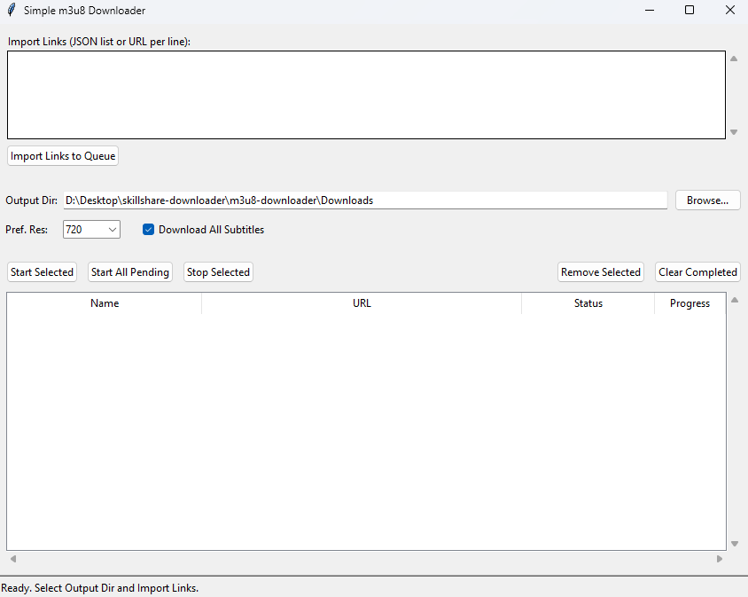

# Simple m3u8 Downloader GUI

A straightforward Python application with a graphical user interface (GUI) for downloading videos streamed via HLS (m3u8 manifests). It aims to provide basic download manager features for handling these types of streams.



## Features

*   **Graphical User Interface:** Easy-to-use interface built with `tkinter`.
*   **HLS (m3u8) Downloading:** Parses master and media playlists to download video and audio segments.
*   **Resolution Selection:**
    *   Option to prefer a specific resolution (e.g., 720p).
    *   Falls back to the best available quality (highest bandwidth/resolution) if the preferred one isn't found or "Best" is selected.
*   **Subtitle Download:**
    *   Automatically finds and downloads **all** available subtitle tracks (usually `.vtt`).
    *   Handles segmented VTT subtitles (where subtitles are also delivered via an m3u8 playlist).
*   **Multiple Audio Track Download:**
    *   Identifies separate audio tracks associated with the selected video quality.
    *   Downloads and merges the *primary* audio track (usually marked as 'default' or the first one found) into the final MP4.
    *   Downloads **all other** associated audio tracks as separate audio files (e.g., `.m4a`) using `ffmpeg`.
*   **Segment Merging:** Uses `ffmpeg` to efficiently merge the downloaded video and primary audio segments into a standard `.mp4` container without re-encoding.
*   **Organized Output:** Saves each download (MP4 video, VTT subtitles, extra M4A audio files) into its own dedicated subfolder within the selected output directory, named after the video title.
*   **Link Import:**
    *   Supports importing links from a JSON list format: `[{"name": "Video Title", "url": "http://...m3u8"}, ...]`.
    *   Supports importing plain m3u8 URLs separated by newlines.
    *   Attempts to auto-generate names from URLs if not provided.
*   **Download Queue & Controls:**
    *   View download progress and status in a list.
    *   Start selected downloads or all pending downloads.
    *   Stop selected downloads (attempts graceful stop).
    *   Remove selected items from the queue (stops active ones first).
    *   Clear completed items from the list.
*   **Concurrency:** Downloads video/audio segments concurrently using multiple threads for potentially faster downloads.
*   **Basic Error Handling:** Includes handling for common network errors, invalid manifests, and ffmpeg issues.

## Requirements

1.  **Python:** Version 3.7 or higher recommended (uses f-strings, `concurrent.futures`, etc.).
2.  **pip:** Python's package installer, usually included with Python.
3.  **Python Libraries:**
    *   `requests`: For making HTTP requests.
    *   `m3u8`: For parsing m3u8 playlist files.
    *   Install using pip:
        ```bash
        pip install requests m3u8
        ```
4.  **ffmpeg:** **(Crucial External Dependency)**
    *   This application **requires** `ffmpeg` to be installed on your system.
    *   `ffmpeg` is used for:
        *   Merging downloaded video and audio segments into the final `.mp4` file.
        *   Downloading and saving extra audio tracks directly.
    *   Download `ffmpeg` from the official website: [https://ffmpeg.org/download.html](https://ffmpeg.org/download.html)
    *   Ensure the `ffmpeg` executable is either in your system's **PATH** environment variable or specify the full path to the executable in the `FFMPEG_PATH` constant at the top of the `m3u8_downloader_gui.py` script.

## Installation

1.  **Clone the Repository:**
    ```bash
    git clone https://github.com/your-username/simple-m3u8-downloader-gui.git
    cd simple-m3u8-downloader-gui
    ```
    *(Replace `your-username` with your actual GitHub username)*

2.  **Install Python Dependencies:**
    ```bash
    pip install requests m3u8
    ```
    *(Or, if a `requirements.txt` file is provided: `pip install -r requirements.txt`)*

3.  **Install ffmpeg:** Download and install `ffmpeg` from [ffmpeg.org](https://ffmpeg.org/download.html) and ensure it's accessible via your system's PATH.

## Usage

1.  **Run the Application:**
    ```bash
    python m3u8_downloader_gui.py
    ```

2.  **Set Output Directory:**
    *   Use the "Browse..." button to select the main folder where download subfolders will be created (defaults to a "Downloads" folder in the script's directory).

3.  **Set Preferences (Optional):**
    *   Choose your preferred video resolution (e.g., "720", "1080", or "Best").
    *   Check/uncheck "Download All Subtitles" as desired.

4.  **Import Links:**
    *   Paste m3u8 URLs (one per line) *or* a JSON list (like `[{"name": "...", "url": "..."}, ...]`) into the input text box.
    *   Click "Import Links to Queue".

5.  **Manage Downloads:**
    *   The imported links will appear in the list view below.
    *   Select items in the list (use Shift/Ctrl for multiple).
    *   Use the buttons ("Start Selected", "Start All Pending", "Stop Selected", "Remove Selected", "Clear Completed") to manage the queue.
    *   Status and progress will be updated in the list view.

6.  **Find Files:**
    *   Successfully completed downloads will create a subfolder inside your chosen Output Directory (e.g., `Downloads/My Video Title/`).
    *   Inside the subfolder, you'll find:
        *   `My Video Title.mp4` (The main video file with primary audio)
        *   `My Video Title.[lang].vtt` (Subtitle files for each language)
        *   `My Video Title.audio.[lang_or_name].m4a` (Extra audio tracks, if any)

## Configuration

*   **`FFMPEG_PATH`:** If `ffmpeg` is not in your system PATH, you can edit the `m3u8_downloader_gui.py` script and change the `FFMPEG_PATH = "ffmpeg"` line near the top to the full path of your `ffmpeg` executable (e.g., `FFMPEG_PATH = "C:/ffmpeg/bin/ffmpeg.exe"` or `FFMPEG_PATH = "/usr/local/bin/ffmpeg"`).

## Limitations & Known Issues

*   **DRM/Encryption:** This tool **cannot** download content protected by DRM (Digital Rights Management) or streams encrypted with keys that are not publicly accessible (e.g., `EXT-X-KEY` tags requiring authentication).
*   **Complex Streams:** May not handle highly complex HLS manifests or streams with frequent discontinuities perfectly.
*   **Live Streams:** Primarily designed for VOD (Video On Demand) streams. Downloading live streams might result in incomplete files.
*   **Error Handling:** While basic error handling exists, edge cases or network instability might cause unexpected failures.
*   **UI Responsiveness:** During intensive operations like merging very large files with `ffmpeg`, the UI might become temporarily unresponsive.

## Future Improvements (Potential Ideas)

*   More robust error handling and automatic retries.
*   Option to select specific audio/subtitle tracks instead of downloading all.
*   Bandwidth limiting options.
*   Improved UI/UX (progress bars for individual tasks, better themes).
*   Packaging the application into an executable (e.g., using PyInstaller).
*   Option to convert VTT subtitles to SRT using `ffmpeg`.

## Contributing

Contributions, issues, and feature requests are welcome! Feel free to open an issue or submit a pull request.

## License

This project is licensed under the MIT License - see the [LICENSE](LICENSE) file for details.